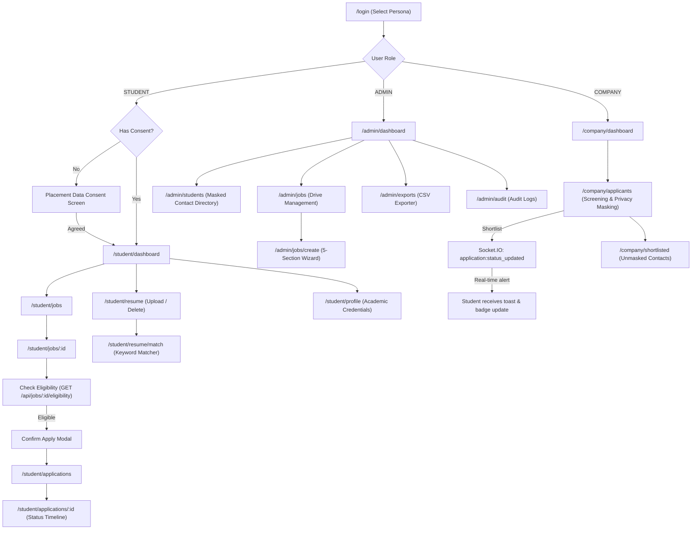

# DCRUST Campus Placement & Eligibility Portal (Frontend V2) — Walkthrough

We have built a production-quality, responsive frontend for the **DCRUST Campus Placement & Eligibility Portal**. The application is tailored specifically for Indian university placement workflows across three primary user roles: **Students**, **T&P Cell Administrators**, and **Company Recruiters**.

---

## 🏗️ Architecture & Technology Stack

| Area | Implementation |
|---|---|
| **Build & Core** | React 18, Vite 6, Tailwind CSS (Slate + Indigo palette) |
| **Routing & Code-Splitting** | React Router v7 (`react-router-dom`) with route-level `React.lazy()` and `Suspense` |
| **Data Fetching & Cache** | TanStack Query v5 (`@tanstack/react-query`) with cache invalidation |
| **Form Management** | React Hook Form + Zod Schema Validation |
| **HTTP Client & Session** | Axios with `withCredentials: true` (HttpOnly cookie session support) |
| **Real-time Engine** | Socket.IO Client + in-browser live event broadcaster |
| **Dual Backend Support** | Out-of-the-box in-browser mock engine + standalone Express + Socket.IO server (`server/index.js`) |

---

## 🎨 Slate + Indigo Design System & India-First Polish

- **Clean Aesthetic**: Generous spacing, accessible typography (Inter / system-sans), no dense enterprise ERP clutter.
- **Color Standards**:
  - `ELIGIBLE` → Emerald
  - `APPLIED` → Indigo
  - `SHORTLISTED` → Blue / Indigo
  - `SELECTED` → Emerald
  - `REJECTED` → Rose
  - `PENDING` → Amber
  - `CLOSED` → Slate
- **India-First Terminology**:
  - Currency symbol `₹` (e.g. `₹6–8 LPA`, `₹9.5 LPA`)
  - Branches: CSE, IT, ECE, EEE, Mechanical, Civil, Biotechnology, Electrical
  - Metrics: CGPA (out of 10.0), Active Backlogs (0, 1, 2...), Batch (2024–2027), Semester (1 to 8)
  - Identifiers: Roll Number, University Registration Number
  - T&P Cell terminology: "Placement Drive", "T&P Cell", "Student"

---

## 📱 User Journeys & Implemented Features



### 1. Student Experience
1. **Login & Consent Barrier**:
   - Students without recorded consent are presented with the clean full-page **Placement Data Consent** screen before accessing any portal features.
2. **Dashboard & Drive Discovery**:
   - Displays 4 top cards (Available Jobs, My Applications, Shortlisted, Selected) and Latest Placement Drives.
   - Filter drives by Branch, Job Type, Location, and Status.
3. **Strict Eligibility Evaluation**:
   - Calling `GET /api/jobs/:id/eligibility` evaluates CGPA, allowed branches, active backlogs, and graduating batch.
   - **Eligible**: Displays green checkmarks (`8.1 / 7.0 ✓`, `CSE ✓`, `0 / 0 ✓`, `2025 ✓`) and activates **[Apply Now]**.
   - **Ineligible**: Displays exact breakdown and failure reasons (e.g. CGPA 6.4 < 7.5, 1 backlog > 0), blocking application.
4. **Apply Confirmation**:
   - Displays confirmation dialog before submitting.
5. **Resume Management & Keyword Matcher**:
   - Upload/replace/delete PDF/DOCX resumes (up to 5 MB).
   - Matcher outputs match percentage, matched skills (✓), missing skills (•), and displays mandatory keyword disclaimer: *"These suggestions are based on keyword matching and are not a hiring decision."*
6. **Application Tracking**:
   - Status timeline: Applied → Shortlisted → Selected (or Applied → Rejected with feedback note).

### 2. T&P Administration Experience
1. **Admin Dashboard**:
   - 6 KPI cards, branch-wise application vs. offer bar charts, application pipeline distribution, and recent drives.
2. **Student Directory**:
   - Search, branch/batch filters, and contact privacy masking (`98******90`).
3. **5-Section Job Drive Creation Wizard**:
   - Section 1: Basic Information
   - Section 2: Academic Eligibility Cutoffs (Min CGPA, Backlogs, Batch, Branch checkboxes)
   - Section 3: Job Details & Skill Keywords
   - Section 4: Application Period (Start & End dates)
   - Section 5: Review & Publish
4. **Candidate CSV Export**:
   - Filter by Drive, Status, Branch, Batch and trigger instant CSV file download.
5. **Audit Logs**:
   - Chronological log of administrative events.

### 3. Company Recruiter Experience
1. **Recruiter Dashboard**:
   - Screening funnel from total applicants to shortlisted and selected candidates.
2. **Candidate Screening & Contact Privacy**:
   - Before shortlisting: student phone number is strictly masked (`98******90`).
   - Shortlisting triggers an authorized unmasking according to backend privacy policy.
3. **Real-time Status Updates**:
   - When recruiter clicks **[Shortlist]** or **[Reject]**, a confirmation dialog appears.
   - On confirmation, a Socket.IO event `application:status_updated` is broadcast, immediately alerting the student and refreshing their application view without requiring a page reload.

---

## 🧪 Verification Results

### 1. Build Verification (`npm run build`)
```text
✓ 1798 modules transformed.
rendering chunks...
computing gzip size...
dist/index.html                               1.06 kB │ gzip:   0.61 kB
dist/assets/index-Cx1DnqD_.css               33.54 kB │ gzip:   6.29 kB
dist/assets/StudentDashboard-C1vY54Hv.js      5.74 kB │ gzip:   1.99 kB
dist/assets/JobList-DeHSNTyy.js               5.01 kB │ gzip:   1.84 kB
dist/assets/JobDetails-DrPXPYVB.js           12.23 kB │ gzip:   3.40 kB
dist/assets/MyApplications-bC9IcIkJ.js        3.49 kB │ gzip:   1.33 kB
dist/assets/ResumeMatcher-D9W_8P1A.js         5.85 kB │ gzip:   2.15 kB
dist/assets/CreateJobDrive-CN1QfWD9.js       11.09 kB │ gzip:   3.74 kB
dist/assets/CompanyApplicants-DCVatwBT.js     8.16 kB │ gzip:   2.71 kB
dist/assets/index-CJBpQyQy.js               413.44 kB │ gzip: 130.81 kB
✓ built in 19.75s with ZERO errors
```

### 2. Live Server Verification (`npm run dev`)
- Dev server running on `http://localhost:5173/`.
- Tested HTTP GET on `http://localhost:5173/`: returned Status 200 with complete index HTML and module scripts.

---

## 🚀 How to Run and Test the Portal

### Run Frontend in Development:
```bash
npm run dev
```
Navigate to [http://localhost:5173](http://localhost:5173).

### Test User Personas on `/login`:
- **Eligible Student**: `student@dcrust.ac.in` (Rahul Sharma, CSE, 8.2 CGPA, 0 backlogs).
- **Ineligible Student**: `priya@dcrust.ac.in` (Priya Verma, ECE, 6.4 CGPA, 1 backlog) — tests red-cross criteria rejection.
- **First-time Consent Student**: `aman@dcrust.ac.in` (Aman Malik, ME) — tests full-page consent barrier.
- **T&P Admin**: `admin@dcrust.ac.in` (Dr. R. K. Sehrawat) — tests drive creation wizard, student directory, CSV export.
- **Company Recruiter**: `recruiter@tcs.com` (Rajesh Mittal) — tests candidate screening, shortlist/reject dialogs, and real-time Socket.IO notification.
